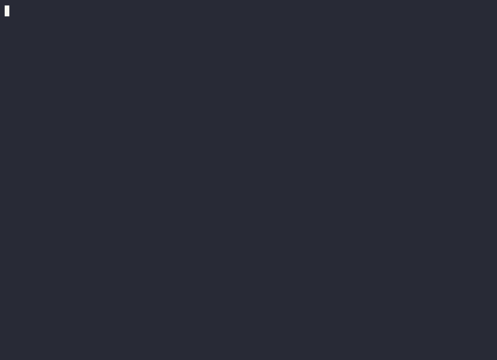

# Kickbacks CLI

A small, local terminal companion for the [Kickbacks.ai](https://kickbacks.ai) VS Code / Cursor extension — see your **status, live earnings, ad history, and derived economics** without opening the editor. (The command is `kickback`.)

  

> Powered by Kickbacks.ai — an independent companion tool, not operated by Kickbacks.ai.



---

## Requirements

- **macOS** (reads the macOS Keychain + your editor's local store). The **menu bar app** needs **macOS 13 (Ventura) or newer**; the CLI itself runs on older macOS too.
- `python3` and `openssl`. `openssl` ships with macOS; `python3` comes with Apple's free **Command Line Tools** — on a fresh Mac the first `kickback` run (or the menu bar app) will prompt to install them (one click, ~a minute). **No pip packages, no build step.**
- The [Kickbacks.ai extension](https://marketplace.visualstudio.com/items?itemName=Kickbacksai.kickbacks-ai) installed and signed in (in VS Code or Cursor)

## Install

```bash
# one-line
curl -fsSL https://gabeperez.github.io/kickback-cli/install.sh | bash

# or Homebrew
brew install gabeperez/kickback/kickback

# or from source
git clone https://github.com/gabeperez/kickback-cli && cd kickback-cli && ./install.sh
```

It copies one script to `~/.local/bin/kickback` and writes a config with **safe defaults** (everything that writes anything is off until you opt in).

## Quickstart — zero to earnings, all from the terminal

```bash
kickback setup      # installs VS Code + the Kickbacks & Claude Code extensions
kickback login      # sign in from the CLI (opens browser for Google) — experimental
kickback            # your live earnings, right in the terminal
```

`kickback setup` leaves a single "Kickbacks: Sign in" click in VS Code — the official, recommended sign-in. `kickback login` is an experimental shortcut that does it entirely from the CLI. Already set up? Just run `kickback`.

```bash
kickback about      # exactly what it reads, sends, and never does
kickback doctor     # live health check
```

## What it does — and what it touches

Run `kickback about` any time for the full, plain-English version. In short:

**Reads (all local, all yours):**
- the extension's own files (`~/.vibe-ads/cli-ad.json`, `debug.log`) — current ad + status
- `~/.claude/settings.json` — to confirm the spinner/statusline are wired
- your editor's local `state.vscdb` — to read **your** Kickbacks access token
- your macOS Keychain — the key that decrypts that token (the same one the editor uses)

**Sends over the network:** only when `network` is on — **your own token + the Claude Code version**, to **Kickbacks' own backend** (the same server the official extension uses). The one other destination is optional: if you opt into `update_check`, a once-a-day GET to our GitHub Pages site fetches a version number (no token, account, or personal data). Nothing else goes to the author or any third party.

**Never:** reads your code/prompts/completions, moves money, clicks ads, or bakes in your account/paths/device — everything is discovered at runtime.

## Safe by default

Every feature that *writes* anything is **off** until you enable it:

| Feature | Default | What it does |
|---|---|---|
| `network` | **on** | contact the Kickbacks backend for earnings (turn off for fully-offline status) |
| `sampler` | off | 60s background job logging ad rotations + earnings → history/daily charts |
| `notifications` | off | daily macOS notification with your earnings |
| `token_refresh` | off | ⚠ when the editor is **closed**, refresh an expiring token and write it back (a backup is saved first) |
| `autorewire` | off | on the 60s sampler tick, restore the spinner/statusline keys in `settings.json` if another tool (Claude Code, hooks) stripped them while the extension is serving (only-if-missing, atomic). Needs `sampler` on. |
| `update_check` | off | once a day, fetch a version file from our GitHub Pages site and print a one-line nudge if a newer CLI is out (no token/account sent). Off = check yourself with `kickback update`. |

```bash
kickback config                 # see all toggles
kickback enable sampler         # opt in (installs the background job)
kickback disable notifications  # opt out (removes it)
```

## Commands

| Command | What it shows / does |
|---|---|
| `kickback setup` | install VS Code + the Kickbacks & Claude Code extensions |
| `kickback login` | sign in from the CLI (browser → Google → writes token) — **experimental** |
| `kickback` | status + live earnings + current ad |
| `kickback earnings` | lifetime/today, velocity, derived per-rotation rate, attribution % |
| `kickback history` (`ads`) | ads seen, counts, derived $ per ad |
| `kickback daily` (`chart`) | per-day earnings sparkline |
| `kickback weekly` (`week`) | per-ISO-week earnings rollup |
| `kickback monthly` (`month`) | per-month earnings rollup |
| `kickback yearly` (`year`) | per-year earnings rollup |
| `kickback auth` | per-editor token: account + expiry |
| `kickback watch [secs]` | live auto-refreshing view (default 5s) |
| `kickback notify` | fire a macOS notification with today's earnings |
| `kickback about` | what it reads/sends + what could break |
| `kickback doctor` | live diagnostics |
| `kickback config` | show settings + feature toggles |
| `kickback config <feature>` | full context for one setting (what it does, what it touches) + how to change it |
| `kickback config set <key> <value>` | edit a scalar value (`notify_hour`, `backend_base_url`, `vibe_ads_dir`, `claude_settings`) |
| `kickback config get <key>` · `edit` | print one value · open the config file in `$EDITOR` |
| `kickback update` | upgrade to the latest CLI via your install channel (brew or the installer); `--check` reports only, `--json` for scripts |
| `kickback enable` / `disable <feature>` | `network` · `sampler` · `notifications` · `token_refresh` · `autorewire` · `update_check` |
| `kickback refresh [--force]` | mint a fresh token (needs `token_refresh`; editor closed) |
| `kickback rewire` | restore the spinner/statusline keys in `settings.json` if they got stripped (no-ops if the extension isn't serving) |
| `kickback install-alias` | add a `kb` shortcut to `~/.zshrc` |
| `kickback --version` · `help` | version / usage |

Global flags: `--json` · `--plain` (no color) · `--offline` (no keychain/network) · `--no-log`.

`--json` is honored by every read/report command — status (default), `earnings`,
`history`, `daily` / `weekly` / `monthly` / `yearly`, `auth`, `config`,
`doctor`, `version` — and by the action commands `enable` / `disable`,
`rewire`, and `notify` (which emit an outcome object). Money is always reported
as canonical integer `micros` (1,000,000 = \$1), with a convenience `usd` float
where useful; output is pure ASCII and stays valid JSON even when there's no
data yet (e.g. `"ads": []`). `doctor --json` adds a top-level `"ok"` boolean for
monitoring. The interactive/streaming commands (`watch`, `setup`, `login`,
`init`, `refresh`, `about`) are text-only.

## Staying up to date

`kickback update` upgrades the CLI through whatever channel it was installed
from (Homebrew or the web installer). If you opt into `update_check`, the normal
status view prints a one-line nudge (throttled to one network call per day)
when a newer CLI is out.

**Menu bar app.** *Kickbacks Bar* is a thin wrapper that shells out to this CLI,
so its earnings/ad data updates the moment the CLI does — the `.app` itself only
needs replacing for GUI changes. Rather than bundle a second updater, the app
learns about its own updates *through the CLI it already calls*: when
`update_check` is on, status `--json` carries an `update` object, and the app
passes its own version via `--app-version`:

```jsonc
// kickback --json --app-version 1.0   (the app's periodic call)
"update": {
  "cli_current": "0.1.4", "cli_latest": "0.1.5", "cli_update_available": true,
  "app_current": "1.0",   "app_latest": "1.1",   "app_update_available": true,
  "app_url": "https://gabeperez.github.io/kickback-cli/KickbacksBar.zip",
  "app_upgrade": "brew upgrade --cask kickbacks-bar"
}
```

When `app_update_available` is true the app shows a "Download update" item. The
version source is a single manifest (`latest.json`) on our GitHub Pages site;
ship a new `.app` by bumping its `app_version` there (`APP_VERSION=1.1 ./release.sh`).
Direct-`.zip` users — who have no Homebrew signal — get the nudge this way too.

## Configuration

Everything lives in `~/.config/kickback/config.json` and is editable by hand — **nothing is hardcoded**:

| Key | Purpose |
|---|---|
| `network_enabled` | master switch for backend calls |
| `features.{sampler,notifications,token_refresh}` | feature toggles |
| `backend_base_url`, `endpoints` | where earnings come from (edit if Kickbacks changes them) |
| `editors[]` | keychain service + `state.vscdb` path + process name per editor (VS Code, Cursor) |
| `vibe_ads_dir`, `claude_settings` | where the extension wrote its files |
| `notify_hour` | hour (0–23) for the daily notification |

## What could change or break it

It's a companion to an extension that updates, so it **degrades gracefully** — earnings just show "unavailable", on-disk status keeps working, and it never crashes:

| Change | Symptom | Fix |
|---|---|---|
| Extension changes the token format/keys | `earned — unavailable` | update the decode (see `kickback doctor`) |
| Backend URL/endpoint changes | `HTTP 4xx/5xx` | edit `backend_base_url` in config |
| Keychain scheme changes | `keychain denied` | re-check the service name in config |
| Signed out / token expired, editor closed | `unavailable` until you reopen the editor | (or enable `token_refresh`) |

`kickback doctor` checks all of these live.

## Earnings accuracy (honest notes)

The backend exposes **only aggregate earnings** (lifetime/today) — never CPM, advertiser cost, per-click value, or billed impression counts. So:
- **Per-ad `$`, effective rate, and per-day totals are *derived*** by attributing earnings deltas to whichever ad was showing. They're approximate and represent *your ~50% share*, not advertiser spend. Labeled as such everywhere.

## FAQ

**Is this safe to run?** It's read-only by default and never sends your data anywhere but Kickbacks' own server (your own token, like the extension does). `kickback about` lists every file it touches.

**Will it get my account banned?** It's read-only by default. The risky writes (`token_refresh`) are opt-in, guarded to when the editor is closed, and back up your tokens first.

**Does it work with Cursor?** Yes — it reads whichever editor (VS Code or Cursor) is signed in, picking the longest-valid token.

**Why are earnings "unavailable"?** Usually the token expired with the editor closed. Open the editor, or enable `token_refresh`. Run `kickback doctor`.

## Make your own demo video

Two reproducible terminal recordings live in `media/`, built with [`agg`](https://github.com/asciinema/agg):

- `make_cast.py` → **feature demo** (`kickback-demo.gif/mp4`) — every command, calmly.
- `make_promo.py` → **promo cut** (`kickback-promo.gif/mp4`) — text cards + money shots + CTA. Edit the `STORYBOARD` list at the top to retime/reword.

Prefix any render with `KICKBACK_DEMO=1` to use coherent **illustrative sample data** (and touch no real account/token/keychain) — handy for public marketing clips. Real data is the default.

```bash
brew install agg                       # one-time (also: vhs is NOT needed)
KICKBACK_DEMO=1 python3 media/make_promo.py    # drop the prefix for your real numbers
agg --theme dracula --font-size 22 --line-height 1.4 --last-frame-duration 3 \
    media/kickback-promo.cast media/kickback-promo.gif
ffmpeg -y -i media/kickback-promo.gif -vsync cfr -r 30 -movflags +faststart \
    -pix_fmt yuv420p -vf "scale=trunc(iw/2)*2:trunc(ih/2)*2" media/kickback-promo.mp4
```

Both capture the **real** tool output under a PTY, so colors and live numbers are genuine. (Heads-up: `ffmpeg -ss` mis-seeks agg's variable-delay GIFs — open the GIF/MP4 directly to preview.)

## Uninstall

```bash
kickback disable sampler          # remove the launchd jobs
kickback disable notifications
rm ~/.local/bin/kickback
rm -rf ~/.config/kickback         # config
# optional history/data:
rm -f ~/.vibe-ads/ad-history.jsonl ~/.vibe-ads/daily.json
```

## License

MIT — see [LICENSE](LICENSE).
